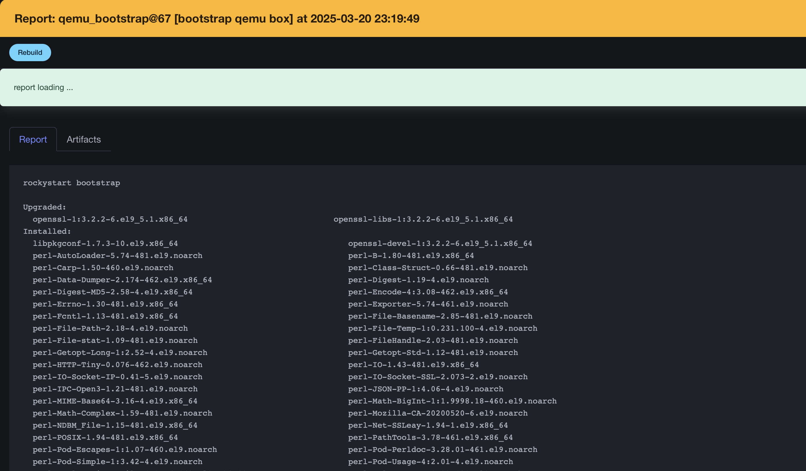
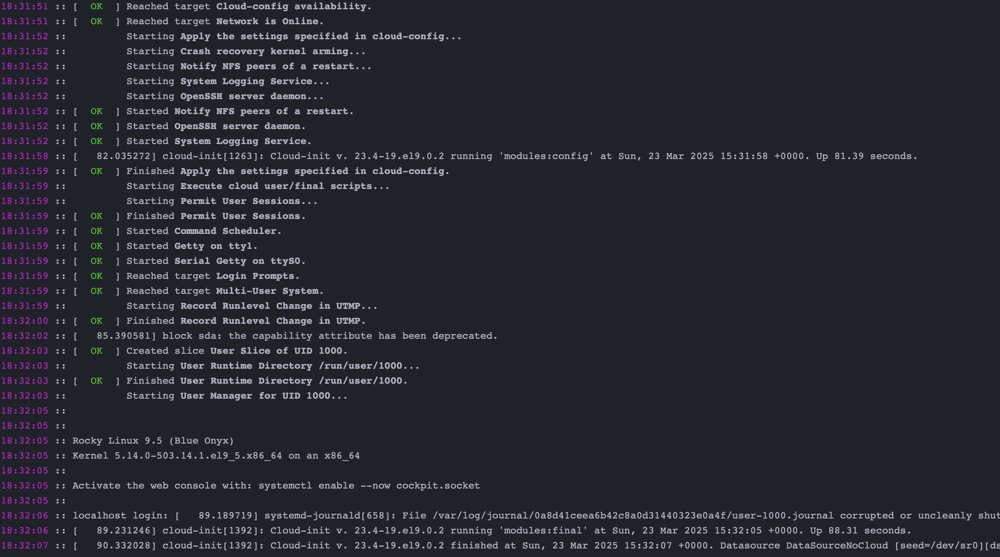

# sparky-qemu-example

Example of running qemu boxes under Sparky

# Install

1. Prepare image to test

```
mkdir -p ~/rocky-linux-distro
cd rocky-linux-distro 
wget https://dl.rockylinux.org/pub/rocky/9/images/x86_64/Rocky-9-GenericCloud-Base-9.5-20241118.0.x86_64.qcow2 -O distro.qcow2
```

2. Copy sparky job

```
git clone https://github.com/melezhik/sparky-qemu-example.git 
cp -r .sparky/projects/ ~/.sparky/projects/
```

3. Go to sparky - http://127.0.0.1:4000 and run sparky-qemu-example job


# Options

## skip_bootstrap

Skip sparrowdo bootstrap stage, useful if you already have an image with
Sparrow dependencies installed

## qemu_new_session

Disable this if you already have active qemu session (VM running and accessible
by ssh, port 10022, user admin)

## qemu_shut_on_fail

Enable this if you want to shut qemu instance (VM) in case of use case scenario fails

## use_case_repo

Use case scenario git repository, as an example look at https://github.com/melezhik/rocky-linux-lamp-check , the repo has to have a `main.raku` file at the root, which
is an entry point for use case scenario

## qemu_binary

Path to qemu binary 

# Example reports



