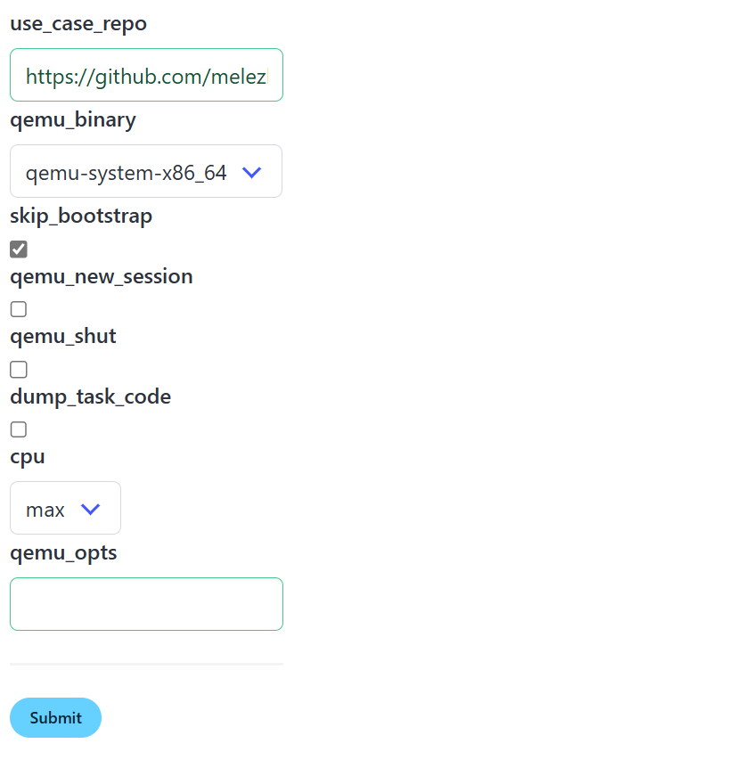
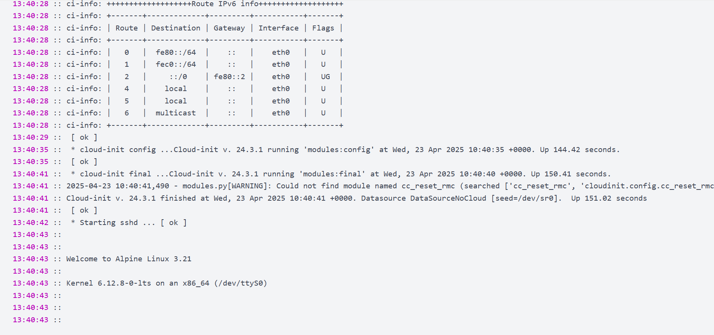
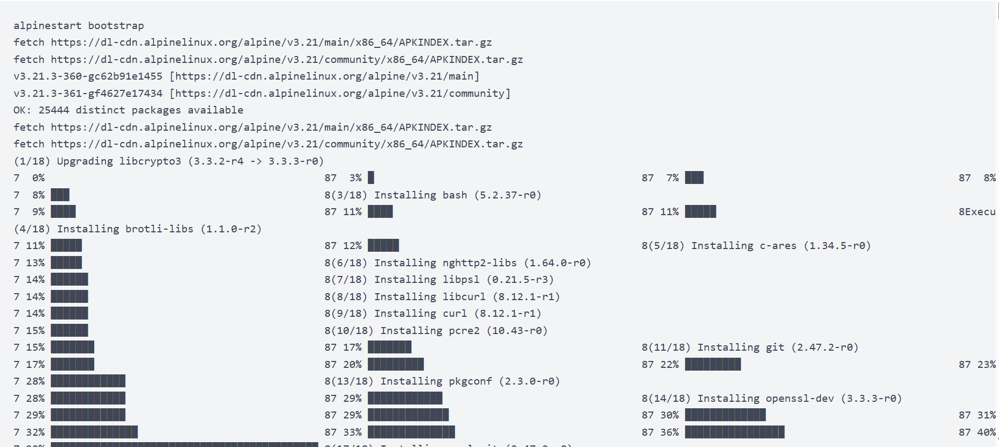
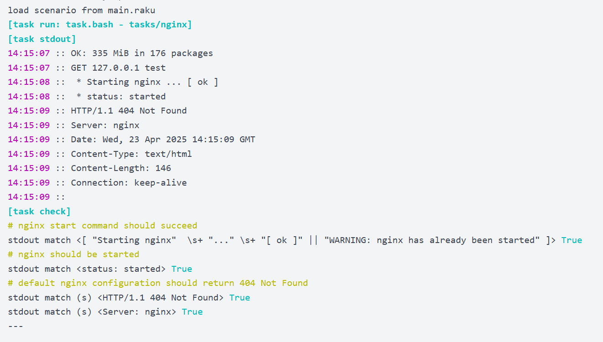
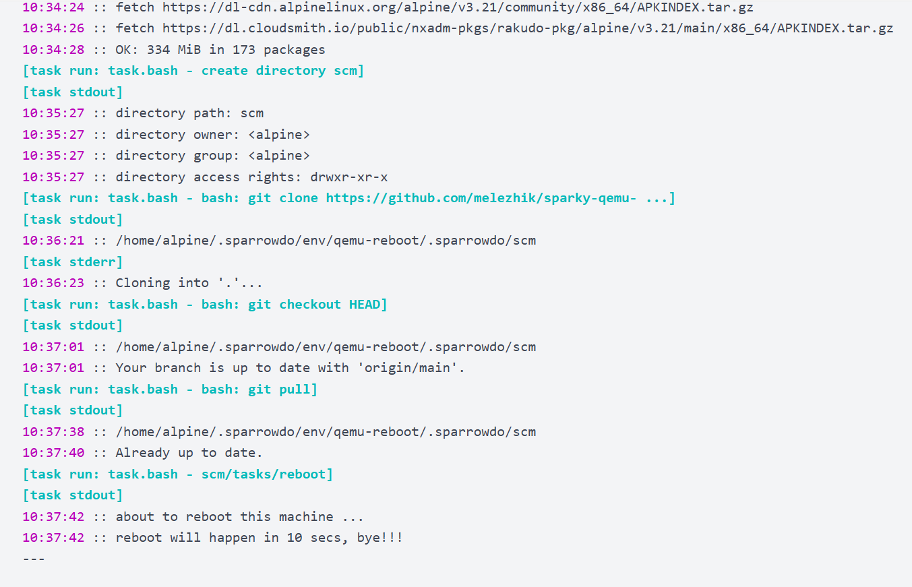

# sparky-qemu-example

Example of running qemu boxes under Sparky

# Install

1. Prepare image to test

```
mkdir -p ~/.distros

cd ~/.distros 

# download qcow2 image

wget https://dl-cdn.alpinelinux.org/alpine/v3.21/releases/cloud/nocloud_alpine-3.21.2-x86_64-bios-cloudinit-metal-r0.qcow2 -O distro.qcow2

# resize is required as alpine images
# do not have enough disk by default

qemu-img resize distro.qcow2  +1G

```

2. Copy sparky job

```
git clone https://github.com/melezhik/sparky-qemu-example.git
cd sparky-qemu-example
cp -rv .sparky/projects ~/.sparky/
```

3. Go to sparky - http://127.0.0.1:4000 and run sparky-qemu-example job


# Options

## skip_bootstrap

Skip sparrowdo bootstrap stage, useful if you already have an image with
Sparrow dependencies installed

## qemu_new_session

Disable this if you already have an active qemu session (VM running and accessible
by ssh, port 10022, login: alpine) and so don't want to start a new session

## qemu_shut

Enable this if you want to shut qemu instance (VM) in the end of the test

## use_case_repo

Use case scenario git repository, as an example look at 
https://github.com/melezhik/sparky-alpine-nginx,
the repo has to have [main.raku](https://github.com/melezhik/sparky-alpine-nginx/blob/main/main.raku) file at the root, which
is an entry point for use case scenario

## qemu_binary

Path to qemu binary 

## cpu

Set qemu cli -cpu option

## qemu_opts

Set arbitrary qemu cli options, for example:

`-accel kvm -smp 8`

## dump_task_code

If enabled dump scenario code, useful for debugging


# Clean up

To start from the scratch:

## Stop qemu session

```bash
s6 --task-run tasks/stop-qemu-box@qemu_binary=qemu-system-x86_64
```

## Remove image files


```bash
rm -rf /tmp/init.iso
rm -rf ~/.distros/distro.qcow2
```

## Download new image

See previous instruction

# Example reports

## Job menu



## Qemu session



## Sparrow bootstrap



## Nginx install



## VM reboot


